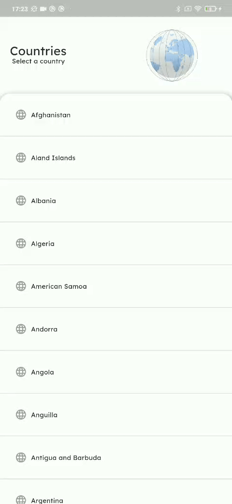

# Smash Stack Project
The Smash Stack project demonstrates the integration of Firebase Firestore with both a Flutter mobile app and a Node.js script for importing data. The project involves creating Firestore collections and documents, importing data into Firestore using a Node.js script, and displaying the data in a Flutter app.

## Usage
1. Start by setting up Firestore and running the Node.js script to populate data.
2. Run the Flutter app to visualize the imported data.

